# Sustainable Supper Club
___
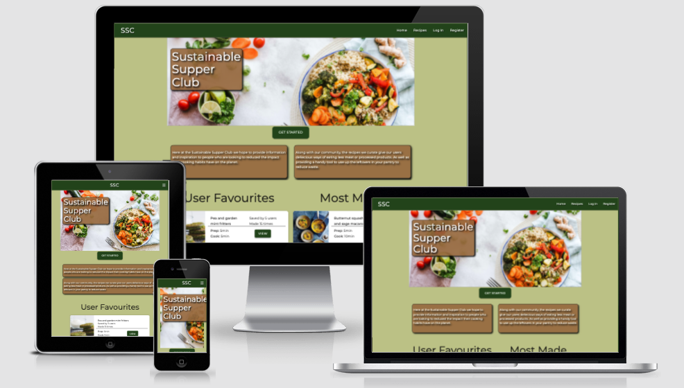


# Project Synopsis

'The Sustainable Supper Club'. A website dedicated to providing users with great vegetarian and vegan recipes based on what they have left over in their pantry. The goal is to open the door for people to live more sustainably and get inspiration for ways to eat less meat and waste less food.


[See the live site here!](https://sustainable-supper-club.herokuapp.com/)

___
# User Experience (UX)

## User Stories

### First time user goals
- I want to find delicious recipes to make.
- I want to search for recipes I can make with the ingredients I already have.
- I'm interested in cooking more vegetarian or vegan food but don't know where to start.
- I want to sign up to get more features easily.

### Returning user goals

- I want to save a list of my favourite recipes.
- I want to be able to easily view recipes that match the ingredients I have left in my kitchen.
- I want to add my own recipes for the community to enjoy.

### Frequent user goals

- I want to see what the community is eating by seeing the top recipes being made.

### Business Goals

- To promote more sustainable eating habits.
- To allow users to find delicious and healthy food to cook.
- To track what people are most enjoying cooking to help future development / customer engagement strategies.

## Design

### Colour Scheme

I wanted to carry across the themes of sustainability and natural eating / living so I sourced the following image of a lushous landscape extracted my colour palette from that.


The resulting palette generated using the [Coloors.co](https://coolors.co/) 'generate from image' tool and was comprised of natural greens and browns. [The full palette can be found here](https://github.com/timmorrisdev/MS3-sustainable-supper-club/blob/main/static/readme_assets/ux/colour_palette/MS3-Palette.pdf)


### Fonts
- Montserrat / Roboto.

    I used Montserrat for most of the site content but kept Roboto on hand for more space-sensitive needs as it is slightly more compact in its width.

### Wireframes
- [Landing Page](https://github.com/timmorrisdev/MS3-sustainable-supper-club/blob/main/static/readme_assets/ux/wireframes/ms3_home-page.pdf)
- [Recipes Page](https://github.com/timmorrisdev/MS3-sustainable-supper-club/blob/main/static/readme_assets/ux/wireframes/ms3_recipes.pdf)
- [Login/Register](https://github.com/timmorrisdev/MS3-sustainable-supper-club/blob/main/static/readme_assets/ux/wireframes/ms3_login-register.pdf)
- [Profile Page](https://github.com/timmorrisdev/MS3-sustainable-supper-club/blob/main/static/readme_assets/ux/wireframes/ms3_profile.pdf)
- [Recipe Details page](https://github.com/timmorrisdev/MS3-sustainable-supper-club/blob/main/static/readme_assets/ux/wireframes/ms3_recipe-details.pdf)
- [Add / Edit Recipe and User Pantry](https://github.com/timmorrisdev/MS3-sustainable-supper-club/blob/main/static/readme_assets/ux/wireframes/ms3_add-edit-recipe.pdf)
- [Admin Area](https://github.com/timmorrisdev/MS3-sustainable-supper-club/blob/main/static/readme_assets/ux/wireframes/ms3_admin.pdf)


### Design Decisions Different to Wireframes


## Data Schema

I chose to use MongoDB, a non-relational database sevice for this project as I felt if fit the my requirements. 

The data structure for this project was organised into two collections - Recipes and Users. Examples of each along with the data types stored can be found below.

- Recipes

    
        {
            "_id": ObjectId
            "recipe_name": String
            "recipe_chef": String
            "recipe_image": URL String
            "recipe_summary": String
            "prep_time": String
            "cook_time": String
            "ingredients": [{"item": x, "quantity": y}]
            "method": ["step1", "step2", "step3"]
            "vegetarian": Boolean
            "vegan": Boolean
            "uploaded_by": String
            "date_added": datetime
            "recipe_made_count": [{"user": x, "time_made": y}]
            "user_favourite": ["user1", "user2"],
            "made_count": Int
            "favourite_count": Int
        }
        
- Users

        {
            "username": String
            "password": String
            "user_recipes": ["recipe1", "recipe2"],
            "admin": Boolean
            "super_admin": Boolean
            "user_ingredients": ["ingredient1", "ingredient2"]
        }

## Features

### Landing Page
Displays the company description and ethos, along with prompts to the user to continue their journey through the site.
- User Favourite and Most Made section.
    - User favourites displays the top 3 recipes saved as favourites by users of the site. This is determined using the 'favourite_count' database field.
    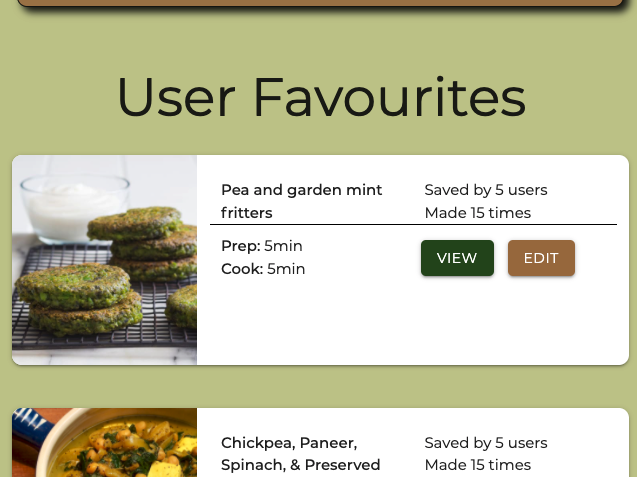
    - Most made displays the top 3 recipes logged by users when they make a meal. This is determined using the 'made_count' database field. There is additional python code to check the last time the recipe was made by the user to prevent multiple counts in the same day, which is done using the 'recipe_made_count' array.
    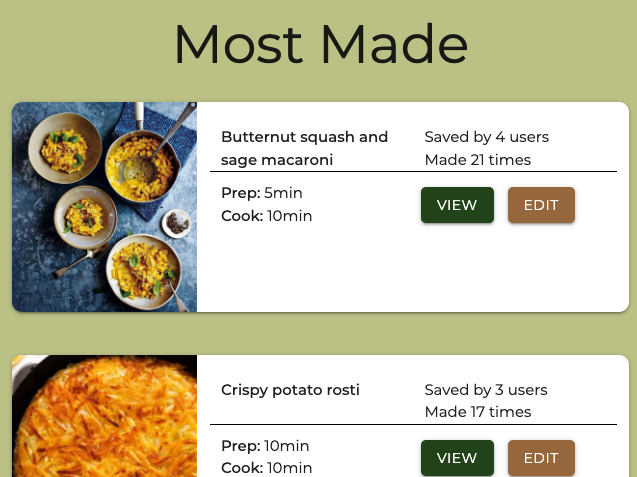

### User Login or Register
- Forms to allow user to create a profile, or login to existing account.

    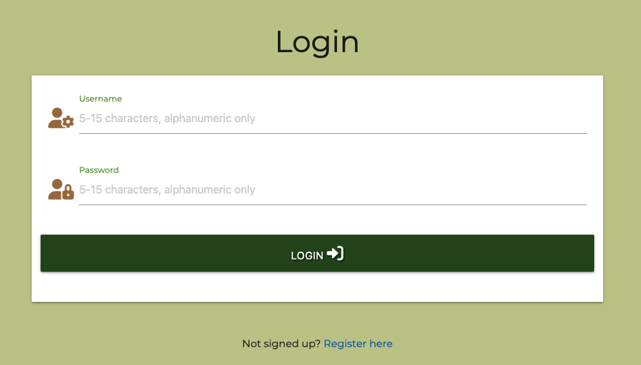

    
### Recipes Page
Displays all recipes on the site, along with a search function. User is encouraged to sign up to gain access to additional features such as the 'pantry search'.
- Search section - Offers the ability to search the database of recipes using user input, or by using the user 'pantry' ingredients stored in their profile. If no user logged in, the pantry search button re-directs to login or register.
    - Search section if user not logged in
    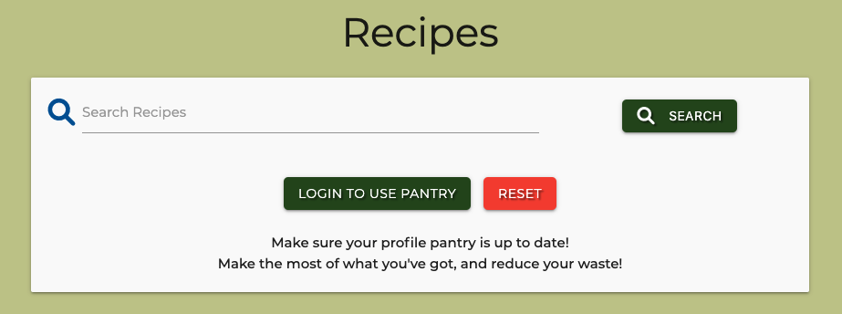

    - Search section if user logged in
    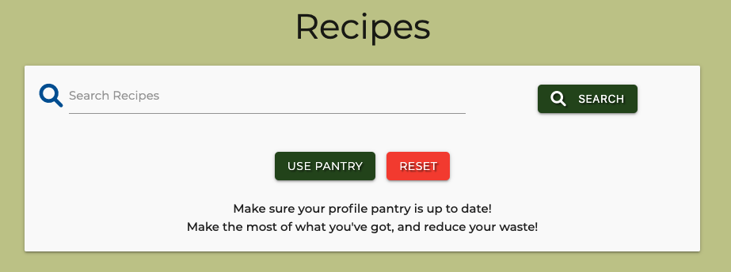
- Recipe Overview - Summary cards displayed for each recipe. If the recipe was uploaded by the logged in user, edit button is visible.
    - Recipe not uploaded by current user.

    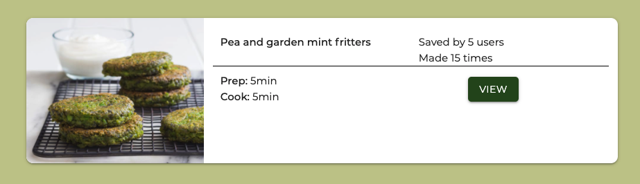

    - Recipe uploaded by current user.

    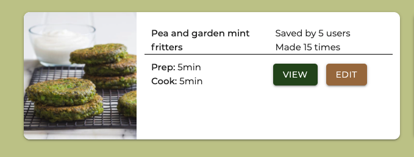

### Recipe Details
Display the full details of the selected recipe to the user. Offers the options to add to user favourites, or log that it was made by the user. Defensive programming in the back end will prevent logging the recipe as made twice in one day.
- Recipe Details Card
    - Overview

    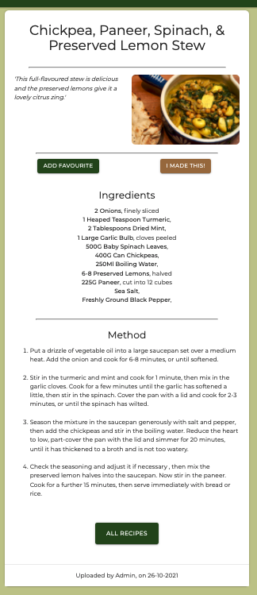

    - Add Favourite Button

    

    - I made this! button with flash messages to inform user when trying to make more than once in a day.

    

    

    

    - Information from database used to give details of when ythe recipe was uploaded, and by whom.

    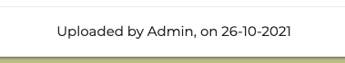

### User Profile Page
Display to the user any recipes they have added as favourites or uploaded themselves. Also offers the 'pantry' feature to upload the ingredients they have in their kitchen to see matching recipes. Additional action buttons available to add a recipe, update pantry and delete user profile.
- 'Your recipes' section.
    - Overview of favourite and uploaded recipes in tab layout.

    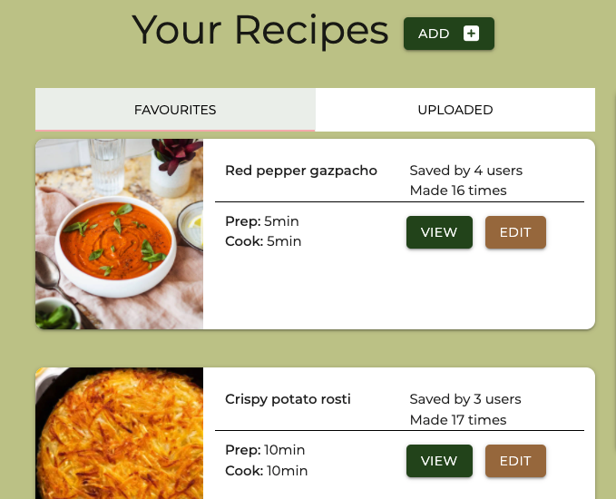

    - Add recipe button. Navigates to add recipe form for user input.

    

    - Add user recipe form. Validation occurs in two stages, I used html 'pattern' and 'validate' attirbutes as well as WTForms validation in the back end. There is additional validation to check for valid image type at the provided URL using the python 'requests' module to look for data tags - will return a user error message and set a default image if any stage fails. 

    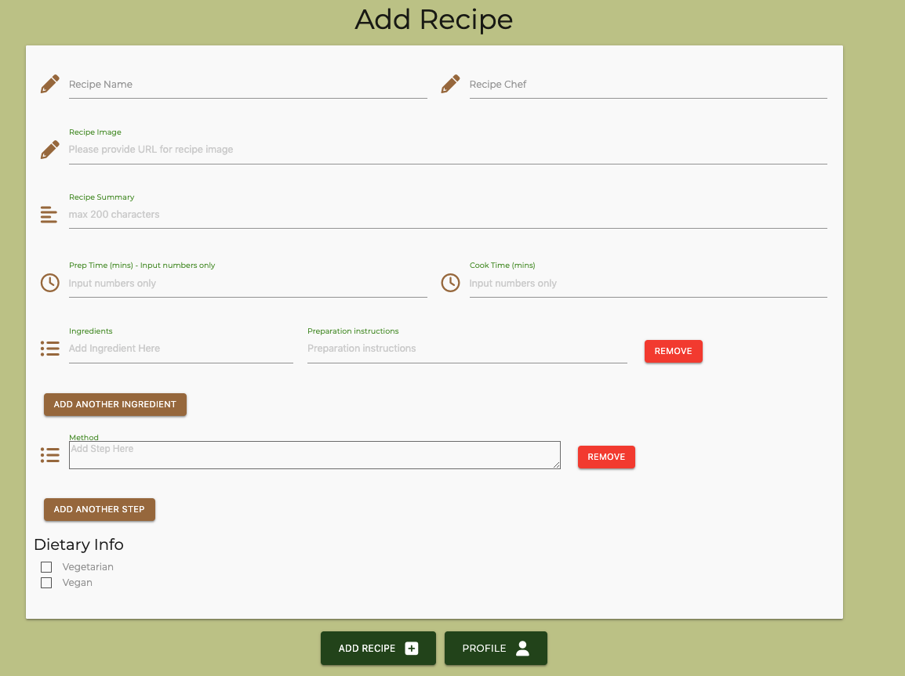

    - User is able to edit any recipes they have uploaded. The form is pre-populated using the database fields.

    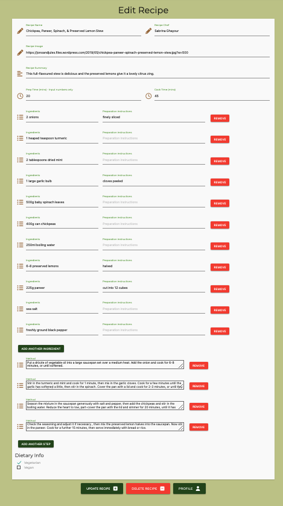

- User Pantry section

    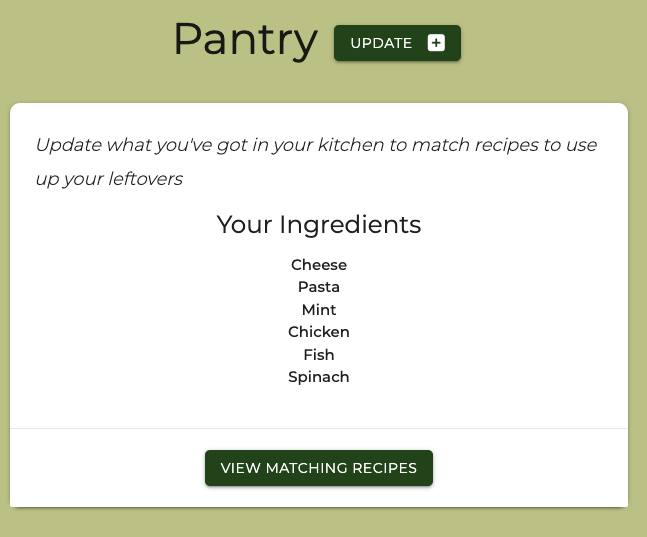
    - Update pantry button - triggers modal.

    

    - Update pantry modal.

    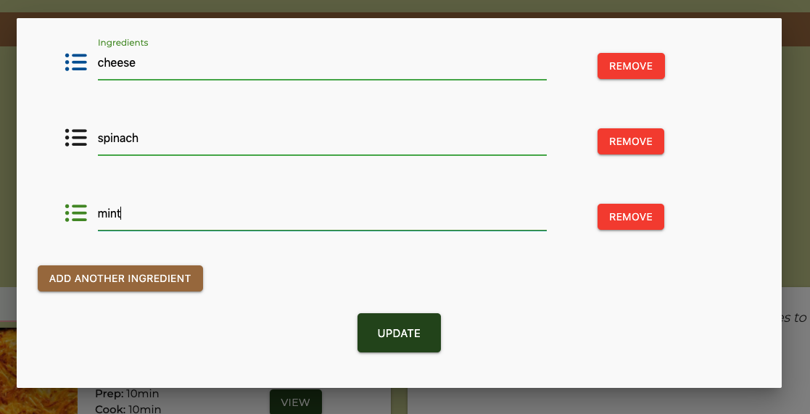


    - View matching recipes button navigates to search results using the user uploaded ingredients as search parameter.

    

- Delete user button and defensive 'are you sre?' modal.
    

    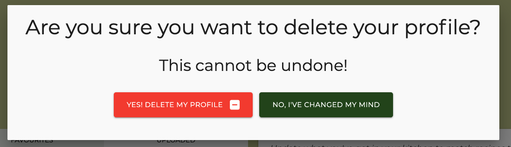

### Admin Area
Admin area offers and overview of all site users along with details of their favourite and uploaded recipes and the ingredients they have in their pantry. If user is a site 'super-user', determined by a database Boolean field, they have access to make other users 'read-only' admins or delete their profile all together.

- Admin page - Super-Admin access.

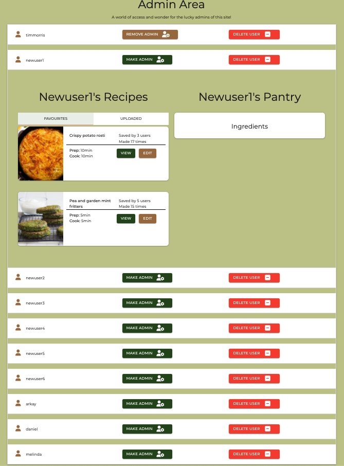

- Admin page - 'read-only' access.


### Other Features
- Responsive across all devices and screen sizes.
- Adaptive to modify content shown to be appropriate for user device or screen size.

### Future Development Opportunities

___
# Technologies Used
## Languages Used
- [Python3](https://www.python.org/downloads/)
- [JavaScript](https://www.javascript.com/)
- [CSS3](https://en.wikipedia.org/wiki/CSS)
- [HTML5](https://en.wikipedia.org/wiki/HTML5)


## Frameworks, Libraries & Programs Used

- [Flask](https://flask.palletsprojects.com/en/2.0.x/) / [Jinja](https://www.palletsprojects.com/p/jinja/)
    - Flask was used to connect my python code in the back-end with the front-end GUI of the application. Jinja language was used as flasks templating engine to give access to desired features coded in python.

- [MongoDB](https://www.mongodb.com/)
    - I used mongo db to host my database collection.
- [jQuery](https://jquery.com/)
    - I used jQuery in my Javascript code for the song remixer game. I mostly made use of event handlers to integrate user interaction with the site with my Javascript functions controlling the features offered to the user.
    - jQuery was also used as part of Materialize and is used for Javascript plugins such as the modals.

- [WTForms](https://wtforms.readthedocs.io/en/3.0.x/)
    - WTForms fields and validators were used in the back-end to validate user input forms across the site and add an extra layer of validation and security on top of the front-end HTML validation.

- [Materialize](https://materializecss.com/)
    - Materialize was used for the responsive 'grid'. Components, such as the cards, were copied from the Materialize documentation and then modified for use in various places across the site.
    - Materialize was also used to provide additional front-end form validation.


- [Google Fonts](https://fonts.google.com/)
    - Google Fonts was used to import the 'Montserrat', and 'Tourney' fonts, which were used throughout the site.
- [Font Awesome](https://fontawesome.com/)
    - Used to source images for the transport section of the remixer.

- [Git](https://git-scm.com/)
    - Git was used for version control using the terminal in Gitpod to 'add' and 'commit' to Git and to push changes to the GitHub repository using 'git push'.

- [Gitpod](https://gitpod.io/)
    - Gitpod.io was used as the primary development environment when coding for the site. It's terminal was used to preview the site via temporary server, and for version control using Git commands.
- [Github](https://github.com/)
    - GitHub was used to store the code pushed from Gitpod and as deployment for the [published site.](https://timmorrisdev.github.io/MS2-song-remixer/)
- [Balsamiq](https://balsamiq.com/)
    - Balsamiq was used to create the wireframes for the site while in the 'skeleton' stage of my UX process.
- [Autoprefixer](http://autoprefixer.github.io/)
    - Autoprefixer was used in the final stage of development to parse CSS code and add vendor prefixes.
- [Coloors.co](https://coolors.co/)
    - Used to source colour palettes used throughout the site.
- [Am I Responsive?](http://ami.responsivedesign.is/#)
    - Used to check responsiveness across different device sizes. 

___
# Testing
## Responsiveness Testing
I used google dev tools throughout the development process to check responsiveness across different screen sizes. 

I was also sure to deploy the site to Heroku early in development to allow for review of the live site on various devices throughout the process.

## W3C Markup, CSS Validation & JSHint Validation
I used the W3C Markup, CSS Validator and JSHint Validator Services to check and validate each page throughout the site to check for errors. 
### [Markup Validation Service](https://validator.w3.org/)
The validator found the following issues for me to address.


### [CSS Validation Service](https://jigsaw.w3.org/css-validator/)
My CSS file style.css passed through the w3 validator with no errors.

### [JSHint Validation Service](https://jshint.com/)
My JavaScript file script.js passed through the validator with no errors. 

### [PEP8 check](http://pep8online.com/checkresult)
The check found two E501 'line too long' errors. These lines contain the URL address for the default recipe image applied if user input fails validation. I was unable to figure out having this URL spread over continuation lines without causing front end rendering errors. 

Other than those issues, my python code was fully PEP8 compliant.

## Lighthouse Testing
Initial lighthouse testing on the app found that some of the accessibillity could be improved. I was able to improve this by adding 'alt' tags to my recipes using the jinja templating language to generate more informative descriptions based on the specific recipe title.

I also added the 'aria-label' attirbute to any actionable buttons or link across the site to further improve accesibility. 

Once this issue was resolved, lighthouse testing returned the following results:

- Landing / Home page
    - The performance score was impacted by the image file types at URLs provided for each recipe. Unfortunately I have no control over the image file type at a given link so felt I could not resolve this issue. I have provided a screen grab of the details below.

    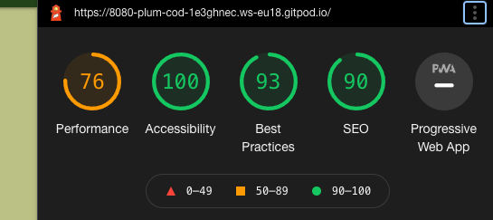

    

- Recipe Page
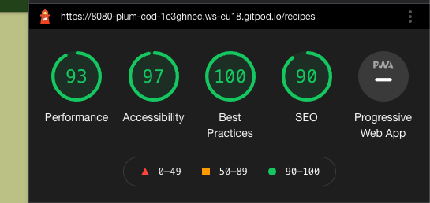

- Recipe details

    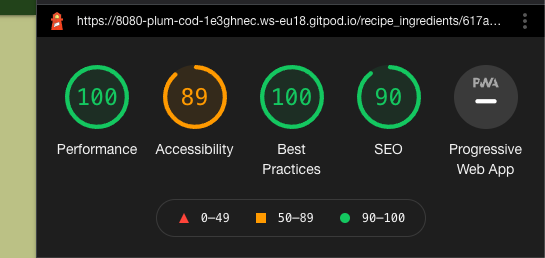

- Register page

    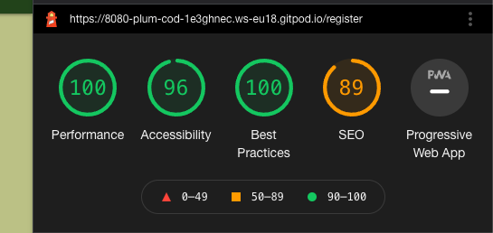

- Login page

    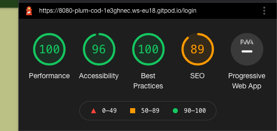

- Profile page

    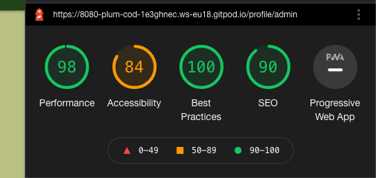

- Add recipe page

    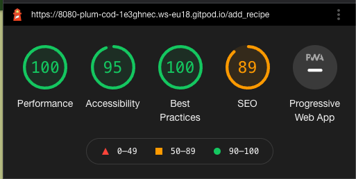

- Edit recipe page

    

- Admin area

    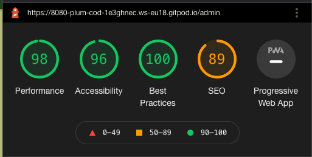


## Testing UX User Stories

### First time user goals

- I want to find delicious recipes to make.
    - I was able to browse all recipes easily and the search function was clear and easy to use to narror down what I was looking for.
- I want to sign up to get more features easily.
- I want to search for recipes I can make with the ingredients I already have.
    - I was able to upload the ingredients I already have to my user profile using the 'update pantry' feature. It was then easy to find recipes that matched the ingredients I had. 
- I'm interested in cooking more vegetarian or vegan food but don't know where to start.
    - By looking at the home page I could get some inspiration based on what other people were making. It was also really helpful to use my pantry search function to see what kind of recipes I could make with the ingredients I already had!


### Returning user goals

- I want to save a list of my favourite recipes.
    - My profile clear showed the list of any recipes that I had selected as a favourite so it was easy to find them again and again.
- I want to be able to easily view recipes that match the ingredients I have left in my kitchen.
    - My pantry was saved in my profile so it was really easy to quickly log on and see what my recipe options were.
- I want to add my own recipes for the community to enjoy.
    - Add a recipe was easy using the form. It was great to share my own favourite recipes with the community.

### Frequent user goals

- I want to see what the community is eating by seeing the top recipes being made.
    - The 'most made' feature on the home page made it really easy to see what had been made the most by the community. It was also helpful that the information was displayed when browsing or search through the full recipe database. 

### Business goals

- To promote more sustainable eating habits.
    - We have a large database of recipes we feel match our criterea of healthy and sustainable. By offering users the option to search using their existing ingredients, we encourage our users to waste less food and try new way of eating better.
- To allow users to find delicious and healthy food to cook.
    - The combined effect of displaying clear information about what the communtiy is enjoying and make, along with an easy-to-use search feature makes it easy for our users to find just the right recipe to make.
- To track what people are most enjoying cooking to help future development / customer engagement strategies.
    - The 'most made' and 'user favourite' section provides a quick view of what our community is enjoying. The admin area allows us to view in more detail the kind things people are saving and adding to their profiles. As well as being able to see the kind of ingredients people more commonly have to inform future recipe additions to the site.

## Peer Code Review
I submitted this project to the slack peer-code-review channel and received the following feedback.
- Desktop navbar very close to edge of screen.
    - This was fixed using CSS styling.
- Labels overlapping on 'add-ingredient' area of add/edit recipe forms.
    - This was caused by the elements being dynamically created using jQuery were duplicating the labels for the section. I was able to edit the code being added in my jQuery function to stop this from happening and make the forms clearer for the user.
- Modal buttons too close to bottom of modal.
    - This was fixed using CSS styling.
- Additional ingredient and method rows hard to select in add/edit recipe form.
    - This was solved by adding class attributes to each of the required sections. Then using the jQuery focus() method to automatically select the last input field when a new row is created.

## Cross-Browser/Device Testing
I tested the site across multiple devices using different browsers.
- Browsers tested
    - Chrome
    - Safari
    - Firefox

- Devices tested
    - Mac Pro w/ Dell 24 inch monitor
    - Macbook Pro 15 inch
    - iPhone 12
    - iPad air 2

## Known Bugs / Issues

___
# Deployment

The project was deployed to Heroku and can be found [here](https://sustainable-supper-club.herokuapp.com/)


## Forking the repository in GitHub
Forking the repository creates a copy of the original repository in your own account to allow changes to be made without affecting the original repository.
1. Log in to GitHub and navigate to the GitHub repository page [here](https://github.com/TimMorrisDev/MS2-song-remixer).
2. In the top-right of the page, below the user avatar, locate the "fork" button.
3. Click the "fork" button and you should now have a copy of the repository in your own account. 

## Making a Local Clone
Details of how to make a local copy of the GutHub repository can be found [here](https://docs.github.com/en/github/creating-cloning-and-archiving-repositories/cloning-a-repository). To clone using HTTPS follow these steps.
1. Navigate to the GitHub repository [here](https://github.com/TimMorrisDev/MS2-song-remixer).
2. Click the "Code" drop-down menu above the list of files.
3. Copy the HTTPS address to the clipboard using the button provided.
4. Open Terminal.
5. Change the current directory to the location you wish to copy the directory.
6. Type 'git clone' and then paste the HTTPS url you copied earlier. 
7. Press enter and your local clone will be created. 

## Create MongoDB database
My data was stored in a [MongoDB](https://cloud.mongodb.com/) collection set up using the following steps.
- Sign up / Sign In to mongodb and create a new cluster.
- Select 'collections' from the cluster dashboard.
- Click 'create database', and create database name and collection name.
- Click 'create collection' for any additional data collections needed for the app.

## Create Flask Application and install pymongo
In the terminal type the following commands to install the required packages:
    
- Install Flask
    ```
    pip3 install Flask
    ```

- Install PyMongo
    ```
    pip3 install pymongo
    ```
- Install flask-pymongo
    ```
    pip3 install flask-pymongo
    ```
- Install dnspython
    ```
    pip3 install dnspython

Setup app
- Create `app.py` and `env.py` using the terminal
    ```
    touch app.py
    touch env.py
    ```

- Create gitignore file using the terminal to keep `env.py `from being pushed to github
    ```python
    touch env.py
    ```

- Within the gitignore file add `env.py` and `__pycache__/`.
    ```python
    env.py
    __pycache__/
    ```

Set up environment vairables and flask instance
- Within `env.py` add the following environment variables:

    ```python
    os.environ.setdefault("IP", "0.0.0.0")
    os.environ.setdefault("PORT", "5000")
    os.environ.setdefault("SECRET_KEY", "YOUR SECRET KEY")
    os.environ.setdefault("MONGO_URI", "YOUR MONGO URI")
    os.environ.setdefault("MONGO_DBNAME", "YOUR DATABASE NAME")
    ```

    - I used [randomkeygen]() to generate my secret key. 
    - To get your mongodb URI, go to your cluster dashboard and hit connect. Select your version of python and copy the string to the clipboard.

Within `app.py` import os, Flask and environment variables and create instance of Flask and PyMongo.
```python
    import os
    from flask import Flask
  
    if os.path.exists("env.py"):
        import env
    
    app = Flask(__name__)

    app.config["MONGO_DBNAME"] = os.environ.get("MONGO_DBNAME")
    app.config["MONGO_URI"] = os.environ.get("MONGO_URI")
    app.secret_key = os.environ.get("SECRET_KEY")

    mongo = PyMongo(app)
```

## Setting up the heroku app
In order to deploy the app via [heroku](https://dashboard.heroku.com/apps), the following steps must be taken. 

- In the terminal, create requirements.txt and Procfile for Heroku to run correctly
    ```
    pip3 freeze --local > requirements.txt
    ```
    ```
    echo web: python app.py > Procfile
    ```
- Push your files to gitHub
- Navigate to [heroku](https://heroku.com/) and create a new app in your dashboard.
- Assign an app name and region and hit 'create app'.
- In your dashboard, click to connect your gitHub and then locate the correct repository to be deployed.
- Click on the settings tab and then click 'reveal config vars' in order to input the data hidden in `env.py` as follows.
        
        IP                  0.0.0.0
        MONGO.DBNAME        sustainable_supper_club
        MONGO_URI           MONGO URI copied from env.py
        PORT                5000
        SECRET_KEY          SECRET_KEY copied from env.py

- Click 'enable automatic deploy' in the app dashboard.
- Click view to see the deployed site!

___
# Credits
## Code
- Environment variables and initial setup of Flask app copied from Backend 'task manager' mini-project. Edited to suit my needs.

- Video series by [Pretty Printed](https://www.youtube.com/watch?v=jR2aFKuaOBs&list=RDCMUC-QDfvrRIDB6F0bIO4I4HkQ&start_radio=1&rv=jR2aFKuaOBs&t=2) for information about how to use WTForms for back end validation.

- [Stack Overflow article](https://stackoverflow.com/questions/10543940/check-if-a-url-to-an-image-is-up-and-exists-in-python) used for basis of back end image validation and modified to suit my purpose.

- [Stack Overflow ariticle](https://stackoverflow.com/questions/209840/how-do-i-convert-two-lists-into-a-dictionary) used to find a way to combine two dictionaries using python 'zip' method. This was used for when a user is adding a recipe to the databse and modified to suit my specific purposes. 
- [Stack Overflow article](https://stackoverflow.com/questions/8774710/unable-to-remove-dynamically-added-content-with-jquery) which inspired my solution for adding and remove rows to user input forms across the site.

- [Geeks for Geeks aritcle](https://www.geeksforgeeks.org/python-datetime-timedelta-function/) inspired solution using timeDelta when checking for multiple logs of a user making a recipe. 

- [Stack Overflow](https://stackoverflow.com/), [w3 Schools](https://www.w3schools.com/) & [CSS tricks](https://css-tricks.com/) were used throughout the project to research solutions to site requirements.

## Content
- All content relating to the organisation written by the developer.
- Recipes uplaoded by admin from the following recipe books.
    - [Sabrina Ghayour](https://www.sabrinaghayour.com/) - Bazaar
    - [Mob Kitchen](https://www.mobkitchen.co.uk/) - Mob Veggie
    - [Katy Beskow](https://katybeskow.com/) - 15 minute vegan

## Media

- Home page slider images all sourced from [Pexels.com](https://www.pexels.com/)
    - [Ella Olsson](https://www.pexels.com/photo/flat-lay-photography-of-vegetable-salad-on-plate-1640777/)
    - [Ella Olsson](https://www.pexels.com/photo/vegetable-salad-3026808/)
    - [Daria Shevtsova](https://www.pexels.com/photo/cooked-food-704569/)
    - [Daria Shevtsova](https://www.pexels.com/photo/cooked-food-with-meats-and-vegetables-inside-white-bowl-1070053/)
    - [Daria Shevtsova](https://www.pexels.com/photo/vegetable-lot-1580466/)
    - [Monicore](https://www.pexels.com/photo/photography-of-tomatoes-near-basil-leaves-1391487/)
    - [Lum3n](https://www.pexels.com/photo/pizza-with-tomatoes-on-black-surface-604969/)
    - [Sebastian Coman](https://www.pexels.com/photo/bowl-of-cooked-food-3590401/)
    - [Pixabay](https://www.pexels.com/photo/ceremonial-tea-set-on-wooden-surface-461428/)
    - [Pixabay](https://www.pexels.com/photo/agriculture-cherry-tomatoes-cooking-delicious-262967/)

## Acknowledgements
- Thank you to my mentor, Can Sucullu for all your guidance and support.
